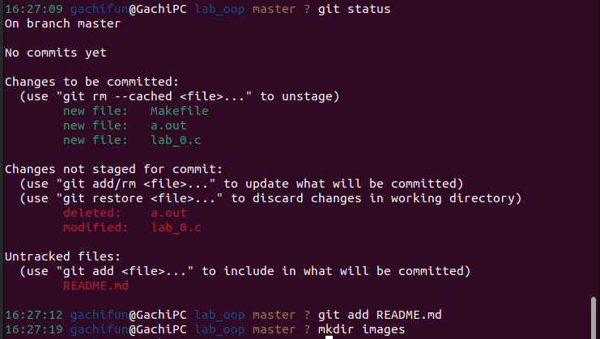

I followed instructions step-by-step, firstly,installed ubuntu and recommended programs, then I started to work with Git, making repository, compiling .c "Hello World" file and then made a remote repository on GitHub

I didn't make a lot of screenshots, so the following picture is the only one I made to show some last commands I made, working with my GitHub repository.
